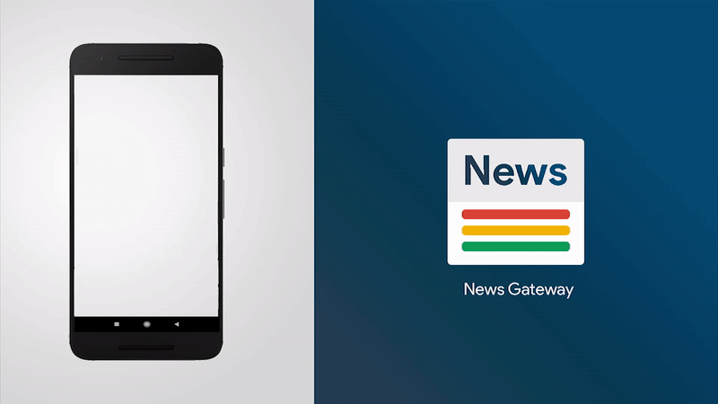

  

<h1 align="center">
  News Gateway
</h1>

  A modern, lightweight News aggregating android app with a minimalist design.

   
  
   
 

## What is News Gateway and why do I care?

News Gateway is a mobile app and news aggregator developed for the Android Operating System.
The app works by pulling in news stories from the web through [News API](http://newsapi.org/) that provides news in 
the JSON format which is pulled in the standard News Gatway Format. Stories are opened in default browser. Stories are updated real-time,
and you'll always find the latest stories when you either refresh or open the app. 

So here comes the “News Gateway” 🎉.

* Top Headlines
* 50+ News Sources across 7 categories
* 5000+ Stories
* Latest News on refresh
* In-app story sharing 
* Material Design.
* Blazingly fast and lightweight.
* No Ads, No Pop-ups.
* Real-time Stories.

  

******* 📣 News Gateway is still evolving. *******

## Status update / Downloads :

[[05-08-2020] Version 1.0](app/release/)

## Platform limitations :

* This is an Android Application, Apologies iOS users (and Windows users).
* This app works great with Android Oreo (API 26) and above.
* As the stories are fetched real-time, you'll need a data connection, to pull in the stories.
* News Gateway is powered by [News API](http://newsapi.org/), thus the correctness of data is limited to the data provider.

## Disclaimer and Privacy statement:

To be 100% transparent:

* News Gateway does not and will never collect user information in terms of user privacy.
* I will not track your IP. 
* No personal data or files will be sent to me or third parties. 

I might use analytics tools to collect basic usage data such as how many times the program has been downloaded.

Feel free to review the source code.

## Contributing:

* News Gateway is free and open source, if you like my work, please consider:
   * Star this project on GitHub
   * Endorse me [here](https://www.linkedin.com/in/chirag-khandhar/)

## Stay tuned 📢

